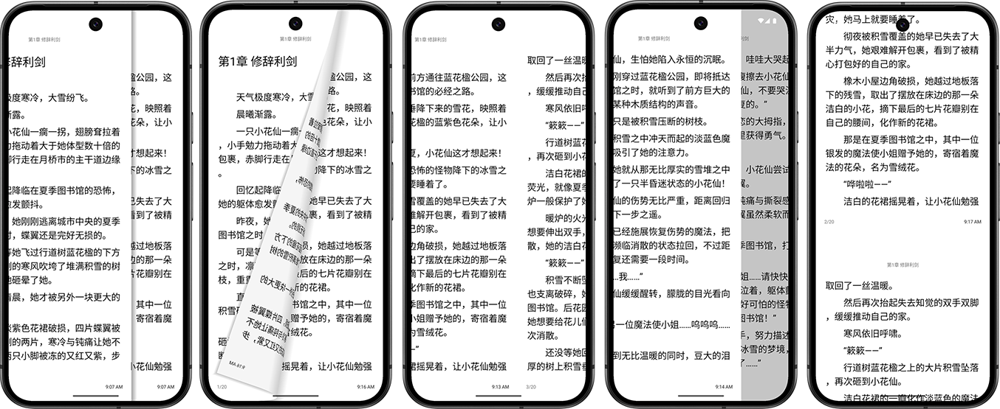

# libreadview

[](https://maven-badges.herokuapp.com/maven-central/io.github.peyilo/libreadview)

A lightweight and customizable Android page turning library inspired by real-world reading experiences. Supports animations like simulation, slide, cover, and scroll styles.


## 🚀 Features

- 📖 Realistic page flip effects (Simulate, Cover, Slide, NoAnim, Scroll)
- 🎨 Easily extendable page manager
- 🧩 Page container layout to manage reading flow
- 💡 Optimized for performance and customization



## 📦 Installation

<details>
<summary><b>Via Jar</b></summary></details>
You can download a jar from [GitHub's releases page](https://github.com/peyilo/libreadview/releases).


<details>
<summary><b>Via Gradle</b></summary></details>
Or use Gradle: 

```kotlin
dependencies {
    implementation("io.github.peyilo:libreadview:0.0.1")
}
```
<details> <summary><b>Via Maven</b></summary></details>

Or Maven:

```xml
<dependency>
    <groupId>io.github.peyilo</groupId>
    <artifactId>libreadview</artifactId>
    <version>0.0.1</version>
</dependency>
```

## 🛠 Usage

`libreadview` works similarly to `RecyclerView`. You provide an `Adapter` and select a page flip animation style to get started quickly.

#### 1. Add `PageContainer` in XML

```xml
<!-- res/layout/activity_page_container.xml -->
<org.peyilo.libreadview.PageContainer
    android:id="@+id/pageContainer"
    android:layout_width="match_parent"
    android:layout_height="match_parent" />
```

####  2. Initialize in Kotlin

```kotlin
class PageContainerActivity : AppCompatActivity() {

    private lateinit var pageContainerTop: PageContainer
    private val colors = mutableListOf<Pair<Int, Int>>()

    override fun onCreate(savedInstanceState: Bundle?) {
        super.onCreate(savedInstanceState)
        setContentView(R.layout.activity_page_container)
        supportActionBar?.hide()

        // Generate demo data: 1000 pages with random background colors and numbers
        repeat(1000) {
            val color = Color.rgb(Random.nextInt(256), Random.nextInt(256), Random.nextInt(256))
            colors.add(Pair(color, it + 1))
        }

        pageContainerTop = findViewById(R.id.pageContainer)

        // Set the initial page index
        pageContainerTop.initPageIndex(1)

        // Choose a page animation manager (see options below)
        pageContainerTop.pageManager = SimulationPageManagers.Style1()

        // Set adapter
        pageContainerTop.adapter = ColorAdapter(colors)

        // Handle tap regions: left 30% = previous, right 30% = next
        pageContainerTop.setOnClickRegionListener { xPercent, _ ->
            when (xPercent) {
                in 0..30 -> pageContainerTop.flipToPrevPage()
                in 70..100 -> pageContainerTop.flipToNextPage()
                else -> return@setOnClickRegionListener false
            }
            true
        }
    }
}
```

#### 3. Implement Adapter

```kotlin
class ColorAdapter(private val items: List<Pair<Int, Int>>) :
    PageContainer.Adapter<ColorAdapter.ColorViewHolder>() {

    inner class ColorViewHolder(itemView: View) : PageContainer.ViewHolder(itemView)

    override fun onCreateViewHolder(parent: ViewGroup, viewType: Int): ColorViewHolder {
        val view = ReadPage(parent.context)
        return ColorViewHolder(view)
    }

    override fun onBindViewHolder(holder: ColorViewHolder, position: Int) {
        val itemView = holder.itemView as ReadPage
        itemView.setBackgroundColor(items[position].first)
        itemView.content.number = items[position].second
    }

    override fun getItemCount(): Int = items.size
}
```

#### ✨ Available LayoutManagers

- CoverLayoutManager()
- IBookSlideLayoutManager()
- SlideLayoutManager()
- NoAnimLayoutManagers.Horizontal()
- NoAnimLayoutManagers.Vertical()
- SimulationLayoutManagers.Style1()
- ScrollLayoutManager()

## 📄 License

This library is licensed under the [MIT License](https://opensource.org/licenses/MIT).
